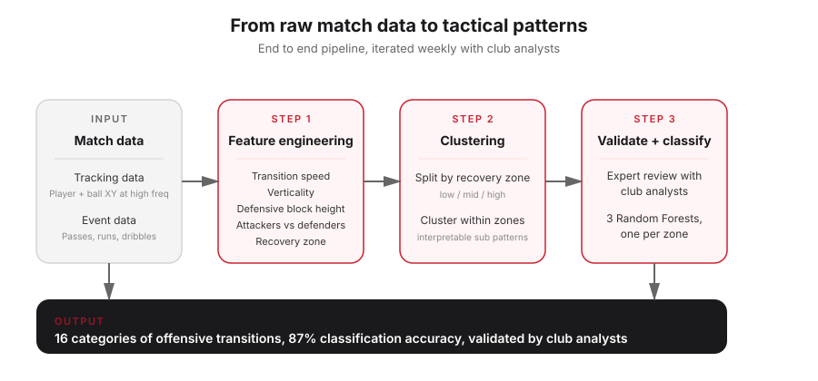
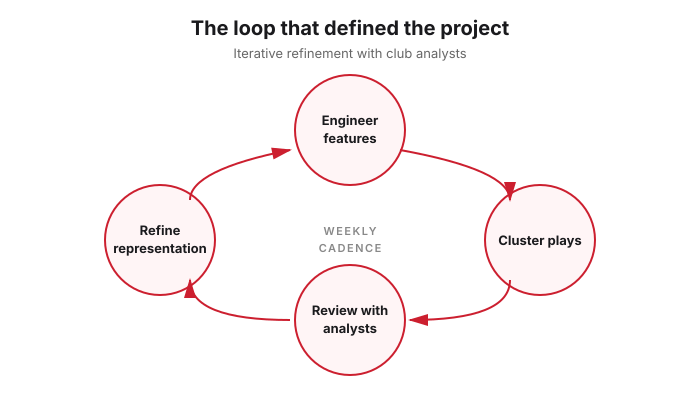
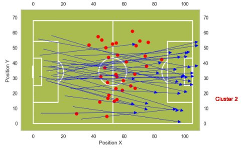
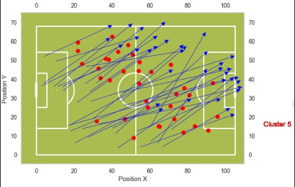
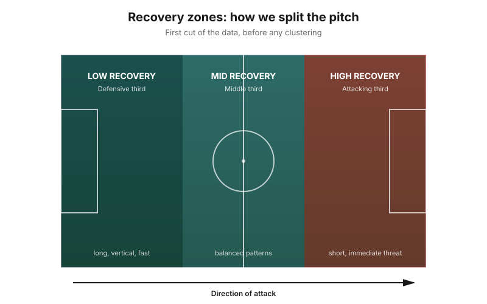
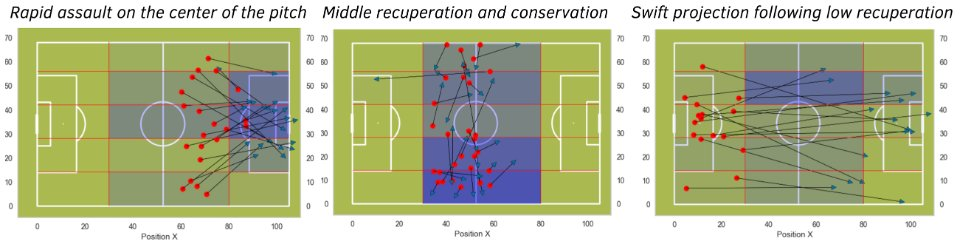

# TikiData × Stade de Reims
### Classifying offensive transitions in Ligue 1 with machine learning

A one year paid project I cofounded and delivered with **Stade de Reims**, a Ligue 1 football club. We turned raw tracking and event data into 16 categories of offensive transitions, classified at 87% accuracy, used by club analysts in match preparation.

> The NBA changed once teams realized a decent three was worth more than a good mid range shot. Football still relies on video review, instinct, and manual note taking. As a lifelong football fan and player, I wanted to see what would happen if we brought that same data mindset to counter attacks.

| | |
|---|---|
| **Client** | Stade de Reims (Ligue 1) |
| **Duration** | 1 year |
| **Team** | 5 cofounders / contributors |
| **My role** | Pitched and negotiated the deal, built features, pushed the recovery zone idea, owned the clustering work |
| **Final accuracy** | 87% on held out actions |
| **Outcome** | Used by club analysts, discussed with the head coach during match preparation |

---

## The problem

Counter attacks have huge tactical value and high variability, but they were still mostly analyzed manually. We worked from two data sources, both provided by **Stats Perform** (OPT feed) and **SportsDynamics** event data:

* **Tracking data** — player XY positions and ball XYZ positions, captured 25 times per second (roughly 150,000 rows per match)
* **Event data** — passes, runs, dribbles, timestamps, phase boundaries

The core question: how do you turn noisy data into recurring patterns that coaches can use?

---

## Approach

The workflow was iterative. We engineered features, clustered the plays with K-means, watched the videos, discussed the outputs with club analysts, then went back and refined the representation. That loop was key in this project.

### First attempt: replicating StatsBomb (2023)

We started by reproducing the methodology from *StratAlign* (StatsBomb 2023) on 400 transitions extracted from 5 carefully selected matches. K-means produced 7 clusters based on simple spatial features, with each action represented by the mean ball position (red dot) and start to end vector (arrow).

The clusters were directionally right but too broad. Plays with very different tactical intent were ending up in the same group.

<table>
<tr>
<td></td>
<td></td>
</tr>
<tr>
<td align="center"><em>Initial cluster 2, too noisy</em></td>
<td align="center"><em>Initial cluster 5, diagonal patterns mixed together</em></td>
</tr>
</table>

### Adding football aware features

We added two families of features.

**Positional features**
* Time spent in each pitch zone
* Height of the defensive block
* Distance between the ball and the defensive block

**Verticality features**
* Transition velocity
* Space gained in the first 5 seconds after recovery
* Number of offensive and defensive players involved

This helped, but the clusters still weren't tight enough.

### The key insight: split by recovery zone first

The turning point came when we stopped trying to cluster all transitions together. Low recoveries, mid recoveries, and high recoveries do not behave the same way. By cutting the data along recovery zones first, the sub clusters within each zone became coherent and football consistent.

Instead of one giant messy clustering problem, we had three smaller interpretable ones. From there, statistical splits inside each zone produced **16 final categories**.

*Three of the sixteen final clusters. Blue intensity reflects average time spent in each pitch zone. Red dots are recovery points, arrows are end points.*

---

## Output

* **16 categories of offensive transitions** after clustering and expert validation. More granular than what humans typically differentiate in practice.
* **Random Forest classifier** trained on 650 expert labelled transitions, with features selected by recursive elimination.
* **87% classification accuracy** on held out actions, up from 67% when we tried to use the unsupervised model directly. Performance is comparable to expert analysts, especially given that even experts disagree on where a transition starts or ends.

### How it was actually used

Once the model was trustworthy, the club used it for two things.

* **Opponent preparation.** Analyze an upcoming opponent's transitions over their last 5 matches, identify their preferred attacking patterns, adapt the defensive setup.
* **Player profiling.** For a given recovery by a given player (defender vs midfielder vs forward), what's the probability distribution over the 16 transition types? This fed into individual scouting and matchup preparation.

---

## What made it work

**Reconciling two data sources.** OPT positional data and SportsDynamics event data used different benchmarks and noisy timestamps. A non trivial part of the project was just getting them to agree.

**Reshaping the data, not the algorithm.** Some tactical patterns barely showed up in the original 5 match dataset. Instead of trying yet another model, we deliberately added matches from teams with more diverse attacking styles so the model could learn the rare cases. Less about ML, more about making the data match the football question.

**Domain validation in the loop.** Every iteration got reviewed by Stade de Reims analysts and a video analyst. Edge cases were corrected, definitions sharpened. The model was never asked to be smarter than the experts, just to scale them.

---

## Stack

`Python` `scikit-learn` `pandas` `numpy` `K-means clustering` `Random Forests` `recursive feature elimination` `event data` `tracking data` `Stats Perform OPT` `SportsDynamics`

---

## What I'd do differently

* **Build for portability from day one.** Our pipeline was tailored to Stade de Reims' data setup. Onboarding a second club would have required real rework. If I started over, I would license the data myself and design every feature to be club agnostic.
* **Productize earlier.** We delivered weekly reports manually. A lighter cadence, better tooling, and a real interface for the analysts would have multiplied the impact at the same effort.

---

## Why this project matters to me

I did not wait for this opportunity. We had an idea, pitched it cold to multiple clubs, got the meetings, sold the vision, and turned it into a paid year long collaboration with a Ligue 1 team.

It also closed a personal loop: connecting a sport I have loved my whole life with the technical work I want to keep building on.

---

## A note on the code and references

This was a paid engagement under NDA, so the codebase and the underlying data are not published here. This README is a faithful description of the methodology and outcomes. Happy to walk through specifics in a conversation.

**Reference:** *StratAlign: Uncovering Tactical Patterns through Large Scale Event Sequence Matching*, StatsBomb 2023. [link](https://statsbomb.com/wp-content/uploads/2023/10/Ahmed_El-Roby-2.pdf)

**Contributors:** Jérémie Taranto, Idris Houir Alami, Alexis Giudicissi, Ghali Harouchi, Aymen Marzak.

---

**Contact:** [LinkedIn](https://www.linkedin.com/in/jeremie-taranto/) · jerem54@mit.edu
